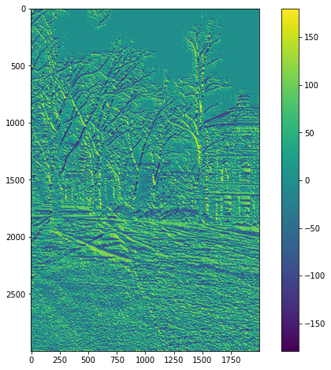
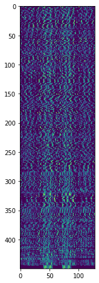

# VFX Project2 Image Stitching

## 成果
### 象山夜景


### 臺北101


### 範例


## 演算法
整體架構由 `main.py` 作為主要程式執行的區塊，而依據不同功能切割成 `utils.py`、`SIFT.py`、`imageStitching.py` 三個檔案。
程式執行首先會透過 argparse 取出我們所需要的參數，如圖片資料夾、用於配對Keypoint的Ratio、圖片的焦距等。

```python
def get_parser():
    parser = argparse.ArgumentParser(description='my description')
    parser.add_argument('-i', '--input_dir', default='test2', type=str, help='Folder of input images.')
    parser.add_argument('-p', '--plot', default='False', type=str, help='Whether to plot result or not.')
    parser.add_argument('-r', '--match_ratio', default=0.6, type=float, help='Ratio for keypoint matching.')
    parser.add_argument('-f', '--focal_length', default=705, type=float, help='focal length of image.')
    return parser
```

## SIFT
### Deference Of Gaussian
SIFT 第一步，首先要算出 DoG，也就是對圖片做不同的高斯模糊後，取差值。  
```python
DoGOctaves, GaussianOctaves = SIFT.to_gaussian_list(img_content['data'])
```

算不同 sigma 下的高斯圖片之差值  
```python
DoGs.append(gaussian_imgs[j].astype('float32') - gaussian_imgs[j + 1].astype('float32'))
```

  

由於圖片過於模糊後，降解析度也可達到同樣效果，還可以減少運算時間，因此每隔 2 sigma 後，就會將解析度降一半  
```python
std_img = cv2.resize(gaussian_imgs[-3], (width // (2 ** i), height // (2 ** i)))
```

### Extrema
算出 DoG 後，要找出 DoGs 中 3×3×3 的最大值與最小值，為了加速運算，這邊用 scipy 與 numpy 去做計算。  
```python
maxConv = DoGOctave * (DoGOctave == maximum_filter(DoGOctave,footprint=np.ones((3,3,3))))
minConv = DoGOctave * (DoGOctave == minimum_filter(DoGOctave,footprint=np.ones((3,3,3))))
threshold = int(0.5 * contrastThreshold / (OctaveLayersCount + 3) * 255)
maxConvInds = np.argwhere(maxConv > threshold)
minConvInds = np.argwhere(minConv < -threshold)
```

### Scale Space Extrema
有了 Extrema 後，對這些 Extrema 做內插，去找到真正的極值位置。
  
```python
gradient = np.array([dx, dy, ds])
hessian = np.array([
                        [dxx, dxy, dxs],
                        [dxy, dyy, dys],
                        [dxs, dys, dss]
                    ])
hessianXY = np.array([
                        [dxx, dxy],
                        [dxy, dyy]
                    ])
extremum = -np.linalg.lstsq(hessian, gradient, rcond=None)[0]
```

抓到後用 KeyPoint Class 將資訊存下來。

### Gradients
為了之後抓到特徵點的方向與力度訊息，因此這邊先對所有圖片使用 Numpy 做預運算，算出 Gradient 與 Magnitude。    

```python
dx = np.gradient(img, axis=1) * 2
dy = np.gradient(img, axis=0) * 2
magnitudes.append(np.sqrt(np.square(dx) + np.square(dy)))
sitas.append(np.rad2deg(np.arctan2(dy, dx)))
```   

* Sita

* Magnitude


### Orientation
最終方向部分，分成 36 個 bin，投票選出最多的方向。而如果投票第二高的方向 >= 第一高的票數×80%，則會分裂成兩個 KeyPoint。  
  
```python
histogram[int(sitaOctaves[octave_idx][sigma_idx][y, x] * bin_count / 360.0) % bin_count] += (math.exp((-0.5 / (scale ** 2)) * ((x - col) ** 2 + (y - row) ** 2)) * magOctaves[octave_idx][sigma_idx][row, col])
```

### Descriptor
Descriptor 部分，從先前得到的 Keypoint，計算 cos、sin 值，將周圍的特徵旋轉，使各個特徵點的朝向一致。當中，bin 的數量已經由先前的 36 bins 更改為 8 bins。  

```python
bin_count = 8
histogram = np.zeros((window_width + 2, window_width + 2, bin_count))
```

  
```python
rot_row = col * sin + row * cos
rot_col = col * cos - row * sin
# minus 0.5 so we can get middle val
row_bin = rot_row / hist_width + window_width / 2.0 - 0.5
col_bin = rot_col / hist_width + window_width / 2.0 - 0.5
row_idx = int(round((keypoint.pt[1] / (2.0 ** (octave - 1))) + row))
col_idx = int(round((keypoint.pt[0] / (2.0 ** (octave - 1))) + col))
```

並且取得 Orientation、Magnitude、與對應的 Pixel 位置。

```python
bin_pts.append([row_bin, col_bin])
weight = math.exp(weighting * ((rot_row / hist_width) ** 2.0 +(rot_col / hist_width) ** 2.0))
mags.append(magOctaves[octave][keypoint.sigma_idx][row_idx,col_idx] * weight)
angles.append((sitaOctaves[octave][keypoint.sigma_idx][row_idx,col_idx] - rot_angle) * (bin_count / 360.0))
```

在將 Orientation histogram 直接 Flatten 之前，透過 Trilinear interpolation 將 histogram 的 Weighting 分散到各個 bin 中。這部分是參考 OpenCV 的實作。
> https://gist.github.com/lxc-xx/7088609


最終將 histogram 壓平，獲得一個 128 維度的 Descriptor。


```python
 # Discard borders
descriptor_vector = histogram[1:-1, 1:-1, :].flatten()
threshold = np.linalg.norm(descriptor_vector) * descrptr_max_val
descriptor_vector[descriptor_vector > threshold] = threshold
descriptor_vector /= max(np.linalg.norm(descriptor_vector), 1e-7)
descriptor_vector = np.round(512 * descriptor_vector)
descriptor_vector = np.clip(descriptor_vector, 0, 255)
descriptors.append(descriptor_vector)
```

### Keypoints
最終得到這些特徵點。  
  
以及對應的 Descriptor (個別特徵點為 128 維度)。  


### Cylinder Mapping
為了減少後面warping產生嚴重的影像扭曲，首先會將每張輸入的圖片投影到圓柱的座標系。
根據以下公式進行轉換:

$ x' = s * \theta = s * \arctan{\frac{x}{f}} $

$ y' = s * h = s * \frac{y}{\sqrt{x^2 + f^2}} $ 

其中f是圖片的焦距。

### Keypoint matching
透過前面的SIFT算出了每張圖的關鍵點座標以及相對應的128維的Feature Descriptor向量後。
這邊利用暴力法去計算兩張圖之間對應的Keypoint，我們首先將圖2的所有Descriptor向量儲存在KD-Tree當中。接著我們Query出目前檢查的這個圖1的keypoint在kd-tree中距離最短與第二短的keypoint，並且計算其Ratio，若低於一定值，我們就會將最短距離的Pair視為合法的Keypoint pair。

```python
for j in range(len(kps1)):
    firstKP = kps1[j].pt
    targetDescriptor = dscrts1[j]
    
    # kd-tree
    tree = spatial.KDTree(dscrts2)
    distance, resultIdx = tree.query(targetDescriptor, 2)
    
    if distance[0] / distance[1] <= args.match_ratio:
        secondKP = kps2[resultIdx[0]].pt
        keypointPairs.append([firstKP, secondKP])
```

### Find best translate
接這利用這些配對好的Keypoint pairs，透過RANSAC演算法找出最佳的位移向量。

RANSAC演算法:

1. 每次取出一組keypoint pair，計算兩個點之間的位移

2. 接著利用這個位移去計算其他pair的inlier，當一個pair內的其中一個點經過位移之後，與另一個點的距離在某個閾值內(我們設0.5)，就會視為inlier。

3. 經過多次迭代後(我們設3000次)，最後取出inlier最多的位移量作為最佳的位移向量。

### Stitching
將右邊的圖片利用前個步驟計算的最佳位移向量，進行位移之後，與左側圖片合併

### blending
針對左右圖片重疊的部分，透過線性的Alpha blending，避免出現明顯的接合邊界。

也就是逐行檢查每個row，針對重疊的部分，越左邊的pxiel，會傾向於左圖的顏色，越往右越傾向於右邊的顏色。

```python
for i in range(rightHeight):
    for j in range(rightWidth):
        if (overlap_mask[i, j] == 1):
            blendedImage[i, j] = alpha_mask[i, j] * leftImg[i, j] + (1 - alpha_mask[i, j]) * rightImg[i, j]
```

### Remove black board
圖片相接之後，周圍會產生黑色邊框。在這個步驟我們會由左而右，再由右而左檢查每個column，如果該column的所有pixel都是黑的話就會移除該column。

### Remove drift
由於每次的相接都會產生部分的y軸位移，當相接的圖片夠多時，就會造成第一張圖與最後一張圖產生嚴重的Y軸下移。


因此我們會將這段Y軸位移平均分散給每張圖的每個pixel，透過每個pixel些微的上移，來抵銷整體panorama的向下趨勢。


## References
1. https://github.com/UWbadgers16/Panoramas